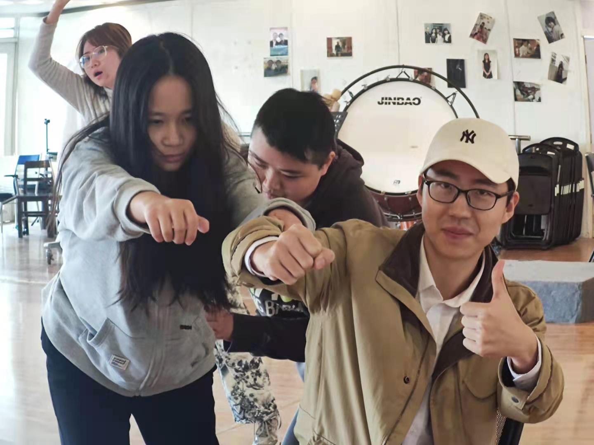

For me, so many aspects in my life worth to log, but the most memorable joyous time is the two years among the friends of the drama club. We recite, rehersal, and performe. I have passed the most lighthearted age. It howled, and darted away. O ever weeping, O ever youthful.

<table><tr>
<td></td>
<td></td>
</tr></table>

<!--  -->

<!--  -->

I like Hermann Hesse, W. Whitman, and R. Feynman.

 

R. Feynman

- **The first principle is that you must not fool yourself, and you are the easiest person to fool**
